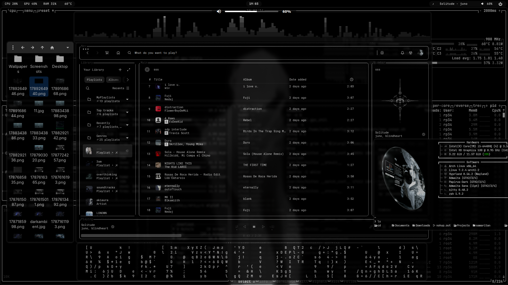

<div align="center">

## Hyprland Setup by 43pr メ

<a href="https://www.youtube.com/@43PR2">▷ YouTube Guides & Showcase</a>

Simple Hyprland setup focused on practical keybinds, productivity, and a smooth workflow easy to customize. Feel free to use as inspiration or as a starting point for building your own setup.

### `Recent updates`

</div>

```text
quickshell   → volume OSD 
waybar       → media marquee effect + improved scripts
hyprlock     → autohide media controls + improved scripts
terminal     → eza icons + starship + zsh shell + autosuggestions + syntax-highlighting
```

<div align="center">

**[Features](#features) ─ [Keybinds](#most-used-keybinds) ─ [Installation](#installation) ─ [Support](#support)**

</div>




Wallpapers: https://wallhaven.cc/user/43pr

## Features

* **Waybar** > Change volume with mouse wheel, mute, play/pause, next and blue light filter
* **Rofi** > App search, clipboard history and switch opacity
* **Zsh shell + starship** (Customizable command-line shell)
* **Custom wallpaper selector** (Awww + Quickshell)
* **Hyprlock** (Lock screen)
* **Wlogout** (Logout menu)
* **Custom scripts**
* **Custom monochrome theme**
* **Spotify + Spicetify Theme:** text by darkthemer (edited)

* **Terminal:** kitty, **File manager:** thunar, **Editor:** xed

> All programs: [packages.txt](packages.txt)

### Wallpaper Selector

Just made some tweaks to it. Give it some love: [hyprquickpaper](https://github.com/iamsurjog/hyprquickpaper)

## Most used keybinds

> **You can modify the keybinds using HyprMod**

| Keybind                 | Action                    |
| -----------             | ------------------------- |
| `Super + T`             | Terminal                  |
| `Super + Q`             | Close active window       |
| `Super + 1, 2, 3..`     | Change workspaces         |
| `Super + Shift + 1, 2..`| Move window to workspace  |
| `Super + D`             | Application launcher      |
| `Super + E`             | File manager              |
| `Super + B`             | Browser                   |
| `Super + W`             | Wallpaper selector        |
| `Super + O`             | Switch opacity            |
| `Super + V`             | Clipboard history         |
| `Super + F`             | Toggle fullscreen         |
| `Super + Space`         | Toggle floating window    |
| `Super + Shift + W`     | Toggle waybar             |
| `Super + Tab`           | Lock screen               |
| `Super + Grave`         | Logout menu               |
| `Super + Mouse wheel`   | Zoom                      |

> All keybinds: [config/hypr/keybinds.lua](config/hypr/keybinds.lua)

---
## Installation 

**READ ALL**

Should work for Arch, Manjaro, EndeavourOS, CachyOS, etc. Let me know if there's any issues

This is mainly intended for a clean installation. If you already have a desktop configuration I recommend to implement manually.

Existing configuration files that are being replaced will be backed up automatically.

> [!tip]
> You can clone the repository first and remove programs from the packages.txt and then run the installer or install them manually for example: 
>
>sudo pacman -S awww grim slurp imagemagick quickshell jq
>
> For beginners I recommend trying noctalia and then implement parts of this setup. It's installed in CachyOs by default and if you really want this specific setup then you can follow the installation.

First install git then use the next command and continue the installation until it's finished:

```bash

sudo pacman -S git   
```
```bash

git clone https://github.com/43PR/dotfiles.git
cd dotfiles
chmod +x install.sh
./install.sh
```

After the installation finishes log out and back in.

> [!note]
> Change the GTK theme to dark if it wasn't changed automatically.
>
> Waybar custom-gpu is specific to my PC so you can remove it or implement.
>
> Any issues with the wallpaper picker just delete cache pictures ".cache/quickshell/thumbs/"
>
> Edit default programs in "config/hypr/hyprland.lua".

<div align="center">

## Support

<a href="https://ko-fi.com/43pr2"><strong>☕ 𝙆𝙤-𝙛𝙞</strong></a>
  ─  
 <a href="https://www.youtube.com/@43PR2"><strong>▷ 𝙔𝙤𝙪𝙏𝙪𝙗𝙚</strong></a>

</div>


