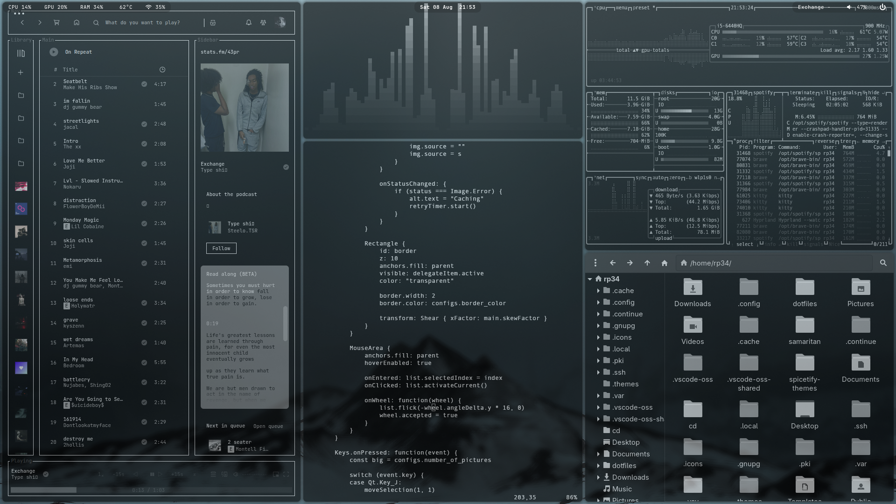
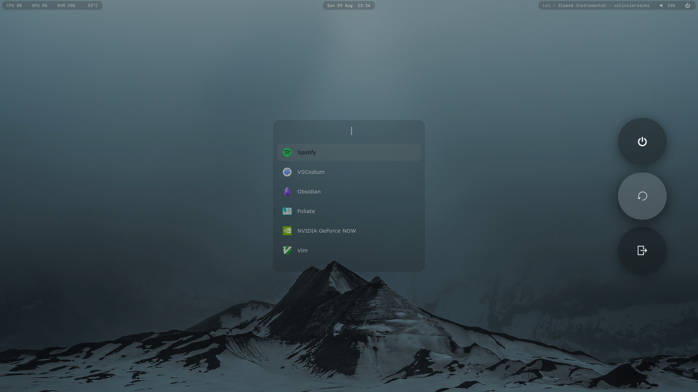

## Simple Hyprland Setup

Full showcase: https://youtu.be/-fGqZo_W268

Setup tutorial: https://youtu.be/DFaSCFysr8s

Simple Hyprland setup focused on practical keybinds, productivity, and a smooth workflow easy to customize

Feel free to use as inspiration or as a starting point for building your own setup.






Wallpapers: https://wallhaven.cc/user/43pr

## Features

* Waybar > Change volume with mouse wheel, mute, play/pause, next and blue light filter
* Rofi > App search, clipboard history and switch opacity
* Hyprlock (Lock screen)
* Wlogout (Logout menu)
* Custom wallpaper selector
* Custom scripts
* Custom monochrome theme
* Spotify + Spicetify. Theme: text by darkthemer (edited)

### Wallpaper Selector

> Inspired by [hyprquickpaper](https://github.com/iamsurjog/hyprquickpaper)

### Most used keybinds

> **$mod = Super = Windows key**

> **You can modify the binds using HyprMod**

| Keybind                 | Action                    |
| -----------             | ------------------------- |
| `Super + T`             | Terminal                  |
| `Super + Q`             | Close active window       |
| `Super + 1, 2, 3..`     | Change workspaces         |
| `Super + Shift + 1, 2..`| Move window to workspace  |
| `Super + D`             | Application launcher      |
| `Super + E`             | File manager              |
| `Super + B`             | Browser                   |
| `Super + W`             | Wallpaper selector        |
| `Super + O`             | Switch opacity            |
| `Super + V`             | Clipboard history         |          
| `Super + F`             | Toggle fullscreen         |
| `Super + Space`         | Toggle floating           |
| `Super + Tab`           | Lock screen               |
| `Super + Grave`         | Logout menu               |
| `Super + Shift + W`     | Toggle waybar             |
| `Super + Mouse wheel`   | Zoom                      |

> **All keybinds in config/hypr/keybinds.lua**

---
## Installation 

> **READ ALL**

Should work for Arch, Manjaro, EndeavourOS, CachyOS, etc. Let me know if there's any issues

**First install git then clone the repository and run the installer:**

```bash

sudo pacman -S git   
```
```bash

git clone https://github.com/43PR/dotfiles.git
cd dotfiles
chmod +x install.sh
./install.sh
```

> **After the installation finishes edit the paths and log out and back in.**

You'll need to edit some paths with your username ".config/wlogoutstyle.css".

Existing configuration files that are being replaced will be backed up automatically.

You can clone the repo and remove programs from the packages.txt and then install if you want.

Edit default programs in "config/hypr/hyprland.lua".

Any issues with the wallpaper picker just delete cache pictures ".cache/quickshell/thumbs/"

---

* [hyprquickpaper](https://github.com/iamsurjog/hyprquickpaper)
* [samaritan-sddm-theme](https://github.com/omerwk/samaritan-sddm-theme)


