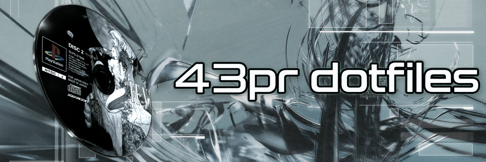
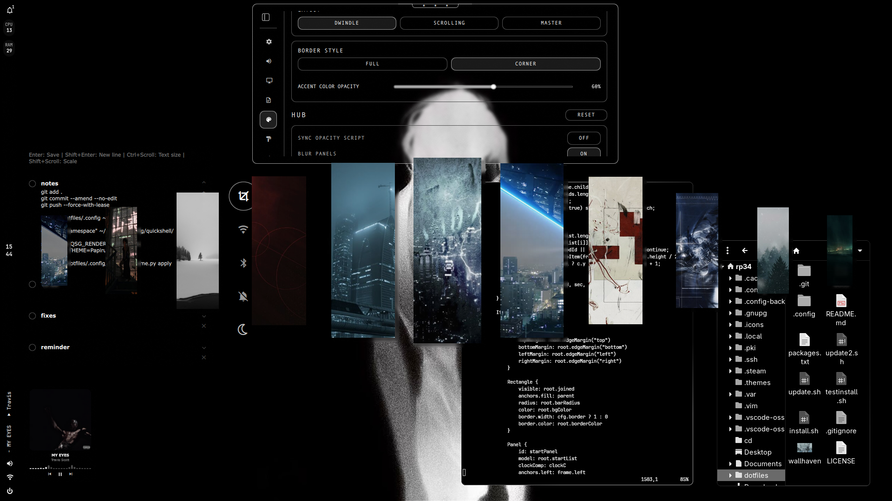

<div align="center">



<p align="center">

<a href="https://discord.gg/j32UAE4WFP"></a>
<a href="https://www.youtube.com/@43PR2"></a>
<a href="https://ko-fi.com/43pr"></a>
</p>

<b><a href="#features">Features</a>  ·  <a href="#keybinds">Keybinds</a>  ·  <a href="#installation">Installation</a></b>

</div>



<p align="center">
  <sub>
    <b>English</b> · <a href="docs/README.es.md">Español</a> · <a href="docs/README.ru.md">Русский</a> · <a href="docs/README.zh-CN.md">中文</a> · <a href="docs/README.ja.md">日本語</a> · <a href="docs/README.pt.md">Português</a> · <a href="docs/README.fr.md">Français</a> · <a href="docs/README.de.md">Deutsch</a>
  </sub>
</p>

<details>
<summary><b>✧ What is this? Requirements?</b></summary>

<br>

A full customizable Linux desktop: bar, system settings and menus to customize your desktop. Built on **Hyprland** (window manager) and **Quickshell** (what the bar and menus are made with). 

This setup aims to keep things simple, fast and practical, and easy to make your own without editing config files.

### Requirements

- **Arch-based distro:** Arch, CachyOS, EndeavourOS, Manjaro, etc.
- **A mostly clean install.** Replaced configs are backed up automatically.

> New to Linux? I recommend watching this [CachyOS Tutorial](https://www.youtube.com/watch?v=rJcrb7vxoCo). 

**Need help?** Join the Discord (button above).

### Hardware

- RAM: 4 GB minimum, 8 GB recommended.
- GPU: Intel, AMD or NVIDIA with compatible wayland drivers.
- Display: Will look much better in FHD or higher.

As reference I made this project with a i5 6th dell laptop with integrated graphics so it should be really smooth in other potatoes too.

</details>

## Features

- **Fast & Lightweight Quickshell** — Optimized desktop components designed to be fast and easy to customize.
- **Top bar** - Customizable bar with settings menu, and quick shortcuts.
- **Settings** — System settings, customize hyprland appearance, bar & themes.
- **Wallpaper picker & Dynamic Colors** — Wallpaper-based color generation & live wallpapers support.
- **Preset Themes** — Monochrome, Nord, Tokyo Night and other popular ones, with support for creating your own.
- **App Launcher** — **Rofi** App search, clipboard history, and opacity controls.
- **Zsh + Starship** — Customizable shell with autosuggestions and history.
- **Notes & Reminders** —  Quick notes, tasks, and reminders.
- **Quick Actions** - Customizable quick actions for Wi-Fi, Bluetooth, night light, and more.
- **Power Menu** — Customizable power menu to shut down, reboot, log out, etc.
- **Hyprlock** — Custom lock screen.
- **Spotify + Spicetify** — Custom theme based on **text - darkthemer**, (modified).

> All programs: [packages.txt](packages.txt)

## Keybinds

Middle click the clock to open settings. To close components use Esc key or use the same keybind. Hover over elements to see actions. 

| Keybind                 | Action                    |
| -----------             | ------------------------- |
| `Super + T`             | Terminal                  |
| `Super + Q`             | Close active window       |
| `Super + D`             | Application launcher      |
| `Super + Space`         | Toggle floating window    |
| `Super + F`             | Toggle fullscreen         |
| `Super + 1, 2, 3..`     | Change workspaces         |
| `Super + Shift + 1, 2..`| Move window to workspace  |
| `Super + E`             | File manager              |
| `Super + B`             | Browser                   |
| `Super + V`             | Clipboard history         |
| `Super + I`             | Settings menu             |
| `Super + S`             | Quick actions             |
| `Super + O`             | Switch opacity            |
| `Super + C`             | Notes & Reminders         |
| `Super + W`             | Wallpaper selector        |
| `Super + Shift + C`     | Color picker tool         |
| `Super + Mouse wheel`   | Zoom in/out               |
| `Super + Shift + W`     | Toggle bar                |
| `Super + Grave`         | Logout menu               |
| `Super + Tab`           | Lock screen               |
| `Super + N`             | Notifications             |
| `Super + R`             | Toggle screen recorder    |
| `Delete`                | Screenshot fullscreen     |
| `SHIFT + Delete`        | Screenshot area select    |

> [!note]
>
> Move and resize windows with Super + left/right mouse drag.
>
> All keybinds: [.config/hypr/keybinds.lua](.config/hypr/keybinds.lua)

---
## Installation 

**READ ALL**

Works for Arch, CachyOS, EndeavourOS, Manjaro, etc. 

This is mainly intended for a clean installation (existing configuration files that are being replaced will be backed up automatically).

**First install git then use the next command and continue the installation until it's finished**

```bash
sudo pacman -S git   
```

```bash
git clone https://github.com/43PR/dotfiles.git
cd dotfiles
chmod +x install.sh
./install.sh
```

After the installation finishes log out and back in. 

> [!important]
> **Do not move or delete the dotfiles repository after installation.**
>
> This setup uses **symbolic links (symlinks)** that point to files inside the cloned repository. If you move or delete the repository, those symlinks will break.
>
> If you relocate the repository, simply run:
>
> ```bash
> ./install.sh
> ```
>
> The installer will update the existing symlinks to point to the new location.

---

### Credits

**Wallpaper selector:** modified, originally built from the [hyprquickpaper](https://github.com/iamsurjog/hyprquickpaper) by iamsurjog.

**Banner artwork:** by cherry✟ ([@aletiune](https://x.com/aletiune)). 
